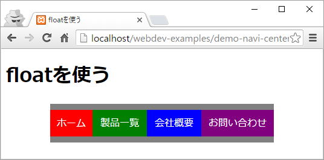
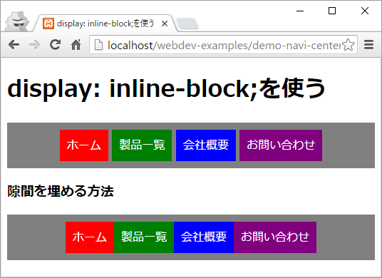
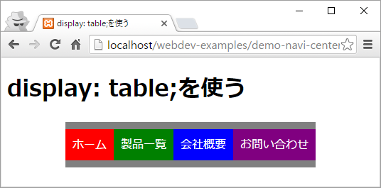

# グローバルナビを中央寄せにする

## 条件
1. メニューの項目を横並びで表示しつつ、メニュー全体をページの中央に表示する。
1. メニューの項目の幅はそれぞれ異なる。
1. **IE8**に対応させる。

- - -
## floatを使う
- [デモ: index.html](http://sutara79.github.io/demo-navi-centering/index.html)

メニューの項目の幅をそれぞれ記述し、その合計値を親要素であるメニューの幅としなければなりません。  
とても面倒だし柔軟性がないのでお勧めできません。

- - -
## `display: inline-block;`を使う
- [デモ: 02.html](http://sutara79.github.io/demo-navi-centering/02.html)

少ない記述で実現でき、柔軟性もあります。  
しかし、インライン要素という性質上、各項目に隙間ができます。  
解決策はありますが、少し面倒です。  
逆に、デザインとして各項目に隙間を設けたいならこれが最良です。

- - -
## `display: table;`を使う
- [デモ: 03.html](http://sutara79.github.io/demo-navi-centering/03.html)

ぴったり隙間なく並べたいならこれが最良です。

